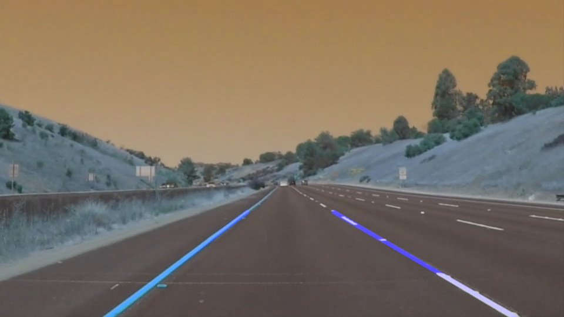

# 车道线检测 

- 读取且显示图像

  ```python
  import matplotlib.pyplot as plt
  import matplotlib.image as mpimg
  import numpy as np
  import cv2
  %matplotlib inline

  image = mpimg.imread('test_images/solidWhiteRight.jpg')
  print('This image is:', type(image), 'with dimensions:', image.shape)
  plt.imshow(image)
  ```

  

- 对图像掩模，获取感兴趣点，首先设置几个顶点

  ```python
  def region_of_interest(img, vertices):
      mask = np.zeros_like(img)   
      if len(img.shape) > 2:
          channel_count = img.shape[2]
          # i.e (255,) * 3 = (255, 255, 255)
          ignore_mask_color = (255,) * channel_count
      else:
          ignore_mask_color = 255
      # 在mask图像上，根据坐标范围画一个多边形，在该多边形内部颜色不变，其他地方使用指定颜色填充
      cv2.fillPoly(mask, vertices, ignore_mask_color)
      # 对图像进行与操作，多边形内部不变，外部全为白色了
      masked_image = cv2.bitwise_and(img, mask)
      return masked_image

  vertices = np.array([[120,540],[880,540],[535,325],[435,325]])
  region_of_interest(img, vertices)
  ```

  

  ​

- 把图像转换为灰度图

  ```python
  def grayscale(img):
      return cv2.cvtColor(img, cv2.COLOR_RGB2GRAY)
  grayscale(img)
  ```

  

- 图像二值化

  ```python
  # 小于200的是0，大雨200的是255
  cv2.inRange(result, 200, 255, result)
  ```

  

- 高斯滤波，去掉高斯噪声，模板值符合高斯分布，cv2.GaussianBlur(img, (3,  3),  0)

  >  除了高斯滤波还有均值滤波，根据模板求均值，模板值全为1，cv2.blur(img, (3,  3))
  >
  > 中值滤波模板用卷积框中像素的中值代替中心值，一般用于去除椒盐噪声。cv2.medianBlur(img, 5)
  >
  > 双边滤波函数为cv2.bilateralFilter()。该滤波器可以在保证边界清晰的情况下有效的去掉噪声。

  ```python
  def gaussian_blur(img, kernel_size):
      # 设置核大小，0表示标准差默认分配
      return cv2.GaussianBlur(img, (kernel_size, kernel_size), 0)
  result = gaussian_blur(img, 3)
  ```

  


- 使用canny算子对图像进行高通滤波，进行边缘检测

  > canny算子不仅可以检测边缘，而且只保留梯度变化最大的方向的边缘线。同时设置了梯度的大小阈值，使得梯度在保留大阈值边缘的同时，检测小阈值获的边缘线是否能和大阈值组合得到的边缘线组成连通区域，若能，则也保留。

  ```python
  def canny(img, low_threshold, high_threshold)
      return cv2.Canny(img, low_threshold, high_threshold)
  result = canny(result, 100, 140)
  ```

  

  ​

- 使用霍夫曼变换，检测直线。

  > 在坐标空间中的点是参数空间中的直线，在坐标空间中的直线是参数空间中的点。把坐标空间中的点全部转换为参数空间中的直线，统计参数空间中每一个点的频率，即坐标空间直线的频率，设置阈值，确定直线。

  ```python
  def hough_lines(img, rho, theta, threshold, min_line_len, max_line_gap):
      # 返回获取到的直线，minLineLength：指定直线的最小长度，maxLineGap=指定被认为是同一直线的最大距	# 离，如果距离在这个范围之内被认为是同一直线
  	lines = cv2.HoughLinesP(img, rho, theta, threshold, np.array([]), minLineLength=min_line_len, maxLineGap=max_line_gap)
      line_img = np.zeros((img.shape[0], img.shape[1], 3), dtype=np.uint8)
      # 这使用到了下一步的画直线的方法
      draw_lines(line_img, lines)
      return line_img
  ```

  

-  画直线

   > 因为道路只有只有左右车道线，所以先遍历所有的直线，根据直线的斜率和直线相对图像的位置，确定直线是左车道线还是右车道线。使用opencv的fitLine方法，最好的拟合这两条直线。获取直线方程，然后在图像上根据y坐标的位置，确定x坐标的位置，分别获得两条直线首尾点的坐标，画出直线。

   ```python
   def draw_lines(img, lines, color=[255, 0, 0], thickness=6):
       left_lane_line = []
       right_lane_line = []
       img_width_half = img.shape[1] / 2 
       for line in lines:
           x1,y1,x2,y2 = line[0]
           # 
           slope = (y2 - y1) / (x2 - x1)
           if slope > 0.5 and x1 > img_width_half and x2 > img_width_half:
               right_lane_line.append([x1, y1])
               right_lane_line.append([x2, y2])
           elif slope < -0.5 and x1 < img_width_half and x2 < img_width_half:
               left_lane_line.append([x1, y1])
               left_lane_line.append([x2, y2])
       draw_lane_line(right_lane_line, img, color, thickness)
       draw_lane_line(left_lane_line, img, color, thickness)
      
   def draw_lane_line(lane_line, img, color, thickness):
       """
       To fit a straight line according to the set of points on each line.
       Line starts from the bottom of the image and ends with 2/3 of the image height.
       """
       if len(lane_line) > 2:
           [vx,vy,x,y] = cv2.fitLine(np.array(lane_line), 2, 0, 0.01, 0.01)
           a = vy / vx
           b = y - a * x
           y1 = img.shape[0]
           x1 = int((y1 - b) / a)
           y2 = int(2 / 3  * y1)
           x2 = int((y2 - b) / a)
           cv2.line(img, (x1, y1), (x2, y2), color, thickness)
   ```

- 把图像和原图合并

  ```python
  def weighted_img(img, initial_img, α=0.8, β=1., γ=0.):
      """
      `img` is the output of the hough_lines(), An image with lines drawn on it.
      Should be a blank image (all black) with lines drawn on it.
      `initial_img` should be the image before any processing.
      The result image is computed as follows:
      initial_img * α + img * β + γ
      NOTE: initial_img and img must be the same shape!
      """
      return cv2.addWeighted(initial_img, α, img, β, γ)
  # weighted_img
  result = weighted_img(result, image)
  ```



- 在视频上进行车道线检测

  > 注意：如果没有安装ffmpge，会报错，**NeedDownloadError: Need ffmpeg exe.** ，安装imageio模块，执行如下代码

  ```python
  imageio.plugins.ffmpeg.download()
  ```

  > 把刚才的操作封装一函数，把该函数传递给视频处理程序

  ```python
  def process_image(image):
      vertices = np.array([[120,540],[880,540],[535,325],[435,325]])
      result = region_of_interest(image, [vertices])
      result = grayscale(result)
      cv2.inRange(result, 200, 255, result)
      result = gaussian_blur(result, 3)
      result = canny(result, 100, 140)
      result = hough_lines(result, 1, np.pi/180, 10, 3, 140)
      result = weighted_img(result, image)
      plt.imshow(result)
      print(result.shape)
      return result
  # 对图像进行处理
  white_output = 'test_videos_output/solidWhiteRight.mp4'
  ## To speed up the testing process you may want to try your pipeline on a shorter subclip of the video
  ## To do so add .subclip(start_second,end_second) to the end of the line below
  ## Where start_second and end_second are integer values representing the start and end of the subclip
  ## You may also uncomment the following line for a subclip of the first 5 seconds
  ##clip1 = VideoFileClip("test_videos/solidWhiteRight.mp4").subclip(0,5)
  clip1 = VideoFileClip("test_videos/solidWhiteRight.mp4")
  white_clip = clip1.fl_image(process_image) #NOTE: this function expects color images!!
  %time white_clip.write_videofile(white_output, audio=False)
  ```

  > 在notebook内部显示视频

  ```python
  HTML("""
  <video width="960" height="540" controls>
    <source src="{0}">
  </video>
  """.format(white_output))
  ```

  


###  当前的程序存在的潜在性缺点

1. 当图像或视频中出现弯道的时候，检测直线就不管用了。
2. 当车辆变道的时候会出现检测不到直线的问题。


### Suggest possible improvements to your pipeline

A possible improvement would be to ...

Another potential improvement could be to ...
